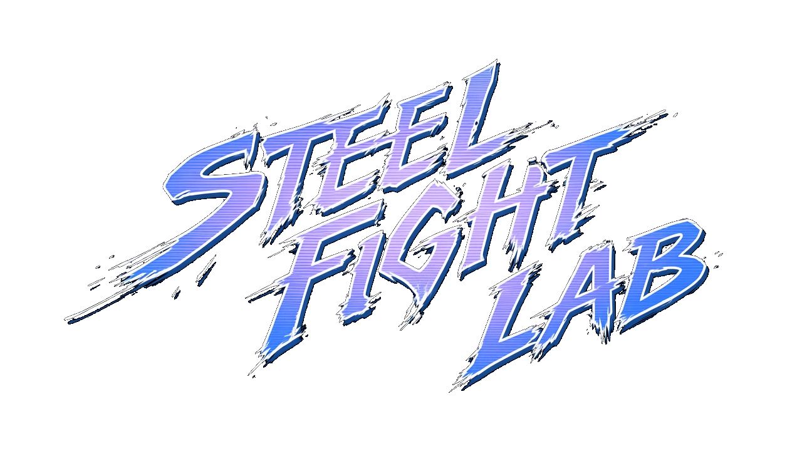

# Steel Fight Lab

<p align="center">
  
</p>

Browser-based 1v1 fighting client with online rooms, tournament brackets, and 3D rendering.

Independent prototype inspired by arena fighting mechanics. **Not an official Valve product** and does not claim full fidelity to Sleet Fighter / Dota 2.

| | |
| --- | --- |
| **Stack** | Nuxt 4 · Vue 3 · Pinia · Tailwind CSS 4 · Three.js · TypeScript |
| **Multiplayer** | WebSocket + client-side rollback · authority on **sleet-fighter-server** |
| **License** | [MIT](./LICENSE.md) (code). Valve assets are **not** included in the license. |

---

## Overview

- Lobby with public rooms, join codes, and host role
- Fighter select, queue, call-up, and brackets (2 / 4 / 8 / 16 / 32)
- Matches with local prediction, authoritative snapshots, and ~30s reconnect (F5 / drop)
- Spectators with a short view delay
- Keyboard + gamepad; forward/back relative to fighter facing

```
/  →  /lobby  →  /select  →  /fight
```

Internal tools: `/dev/game`, `/dev/debug`.

---

## Requirements

- **Node.js 24+**
- Multiplayer backend: **sleet-fighter-server** (recommended) or the built-in mock
- Local 3D assets under `public/fighters` (see [Assets & legal](#assets--legal))

---

## Get started in 5 minutes

```bash
# Terminal 1 — backend (NestJS)
cd ../sleet-fighter-server
npm install
npm run start:dev

# Terminal 2 — client
cd ../dota-model-viewer
npm install
npm run dev -- --port 5174
```

Open [http://127.0.0.1:5174/](http://127.0.0.1:5174/).

### Local mock only (no NestJS)

```bash
npm install
npm run mock:server   # ws://127.0.0.1:3001
npm run dev -- --port 5174
```

The mock is for quick development. For rooms, pause/reconnect, and the HTTP API, use the NestJS server.

---

## Configuration

Public Nuxt / environment variables:

| Variable | Default | Description |
| --- | --- | --- |
| `NUXT_PUBLIC_WS_URL` | `ws://127.0.0.1:3001` | Multiplayer WebSocket endpoint |
| `NUXT_PUBLIC_API_URL` | `http://127.0.0.1:3010` | HTTP API (room list, health) |
| `NUXT_PUBLIC_GITHUB_URL` | `https://github.com/gbrlstr/steel-fight-lab-game` | Title-screen GitHub banner link |

In `nuxt.config.ts`:

```ts
runtimeConfig: {
  public: {
    wsUrl: 'ws://127.0.0.1:3001',
    apiUrl: 'http://127.0.0.1:3010',
  },
}
```

---

## Controls

| Action | Player 1 | Player 2 | Gamepad |
| --- | --- | --- | --- |
| Move | `W` `A` `S` `D` | Arrow keys | D-pad / stick |
| Attack | `Space` | `Enter` | Button 0 / A |
| Special | Left `Alt` | Right `Shift` | Button 1 / B |
| Block | `A` + `S` + `D` (forward + down + back) | Equivalent arrows | Equivalent chord |

Forward/back follow fighter facing. Relative commands and sequences come from the imported moveset.

---

## Scripts

| Command | Description |
| --- | --- |
| `npm run dev` | Nuxt development server |
| `npm run build` | Production build |
| `npm run preview` | Preview the build |
| `npm run typecheck` | Type checking |
| `npm test` | Simulation + network integration (3 clients) |
| `npm run mock:server` | Local WebSocket mock |
| `npm run import:data` | Import combat data from KV3 |
| `npm run import:assets` | Asset pipeline (Source2Viewer CLI) |
| `npm run validate:assets` | Audit GLBs and dependencies |
| `node tools/optimize-glb.mjs` | Strip unused animations under `public/fighters` |

---

## Architecture (summary)

```
app/
  game/shared/combat.ts   # fight rules (mirrored on the server)
  game/net/client.ts      # WebSocket, prediction, and rollback
  game/render/            # Three.js, fighters, camera
  pages/                  # Nuxt routes (lobby, select, fight)
  stores/                 # Pinia (session, room)
docs/                     # networking, validation, movesets
server/index.mjs          # multiplayer mock
tests/                    # automated tests
```

Protocol & authority: [`docs/network.md`](./docs/network.md) · validation: [`docs/validation.md`](./docs/validation.md).

The **server** is the sole authority over HP, authoritative position, and match outcome. The client only sends boolean input masks — never damage or a winner.

---

## Contributing

Contributions are welcome — issues, fixes, netcode/UX improvements, and docs.

1. Fork and create a descriptive branch (`fix/…`, `feat/…`, `docs/…`)
2. Keep changes focused; avoid unrelated refactors
3. Run `npm run typecheck` and `npm test` before opening a PR
4. Describe the problem, the solution, and how to test
5. **Do not** include Valve assets, VPKs, or builds with proprietary content in PRs

Good ideas: visual interpolation after corrections, hit audio, packet-loss network tests, lobby accessibility, CI.

---

## Assets & legal

- Code and docs: [MIT](./LICENSE.md)
- Full attribution: [CREDITS.md](./CREDITS.md)
- *Dota 2* models, textures, animations, maps, UI art, and related media belong to **Valve Corporation**
- Steel Fight Lab does **not** claim ownership of those assets
- Use local exports for development only; **do not redistribute** the VPK or builds with Valve assets
- Local inventory sources: `docs/vpk-inventory.txt`, `imports/original`, manifests under `docs/`

This project does **not** claim full equivalence to official Sleet Fighter. Read `docs/validation.md` before treating the prototype as a fidelity reference.

---

## Related repositories

| Repository | Role |
| --- | --- |
| **[steel-fight-lab-game](https://github.com/gbrlstr/steel-fight-lab-game)** (this) | Nuxt client + render + prediction |
| **sleet-fighter-server** | Authoritative NestJS backend |

---

## License

[MIT](./LICENSE.md) — Copyright © 2026 Steel Fight Lab Contributors.
